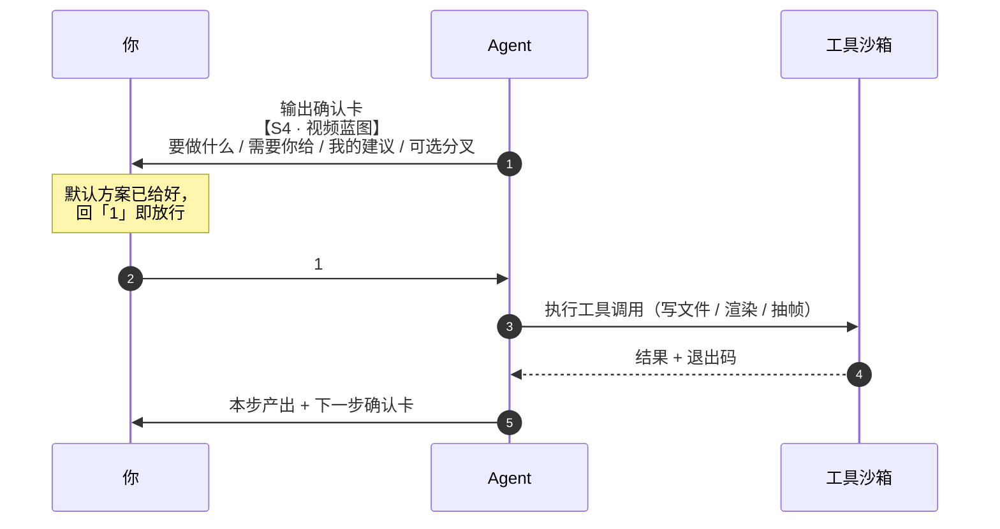
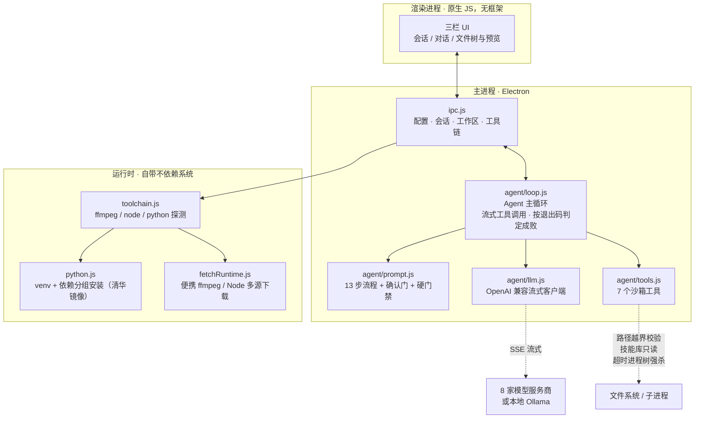

<h1 align="center">知识视频工厂</h1>

<p align="center">
把一条已经跑通 13 期以上的知识科普视频生产线，封装成创作者双击就能用的 Windows 桌面应用。
</p>

<p align="center">
  <a href="https://github.com/SpenBug/science-video-agent/releases/latest"></a>
  <a href="https://github.com/SpenBug/science-video-agent/releases"></a>
  <a href="LICENSE"></a>
  
  
</p>

<p align="center">
  
</p>

---

**内嵌 AI Agent**：你给一个选题，它按 **13 步流程**走完全程，最终产出可直接发布的横版 mp4、封面和发布文案。

**领域不限**：应用内置「领域包」，当前领域的流程规范、权威来源约定、合规红线、模板风格都由领域包承载，顶栏一键切换：

| 领域包 | 适用 | 说明 |
| --- | --- | --- |
| **数模竞赛科普**（默认） | 数学建模竞赛知识视频 | 由已交付 10+ 期的视频生产线技能提供，对竞赛规则原文核对、竞赛合规红线 |
| **通用知识科普** | 历史 / 法律 / 编程 / 健康 / 财经 / 教育 / 科技…… | 同一套确认门、模板与渲染门禁，事实核对走「权威原文」机制 |

> 生产线的完整方法论（确认门协议、11 套模板、实测坑清单）沉淀在 `resources/skills/` 里，
> **随应用一起打包分发**，开箱即用，无需另外安装。

---

## 13 步流水线

一条视频从选题到成片，被拆成三个阶段、13 个可独立验证的步骤：


**核心结论是「钱花在蓝图，坑埋在后期」**——所以流程里埋了三道硬门禁：蓝图没批准绝不写稿，渲染前必过目检，后处理两关不达标不算交付。

---

## 确认门：每一步都要你点头

这是整套流程和普通「提示词模板」最大的区别。**每一步动手前，Agent 必须先输出一张确认卡，你回一个字才继续**：



确认卡固定四行：**要做什么**（含会动到哪些文件）、**需要你给**（编号列出必填输入）、**我的建议**（默认方案 + 理由，让你回「1」就能过）、**可选分叉**。

三条附加规则：一次只推进一步；给默认值不做开放式提问；写文件 / 渲染 / 覆盖产物前必须在卡里点名路径。只读操作（读文件、`ffmpeg -i` 探测、抽帧）免确认。

---

## 架构



**沙箱只给 Agent 7 个受控工具**（文件读写、检索、命令执行、Python），带路径越界校验、技能库只读保护、超时进程树强杀、输出截断。模型能提要求，但碰不到不该碰的东西。

---

## 功能

- **强制确认门**：每一步动手前先出「确认卡」，给默认方案，你回一个字就能推进——蓝图没批准不写稿、渲染前必目检，和真人团队协作一样。
- **11 套成品模板**：深空学术 / 大字清单 / 真题长拆解 / 奶油图解 / 赛事快报 / 纸感笔记 / 数据仪表盘 / 杂志排版 / 黑金权威……并列清单和推导链各有专属版式；T11 单文件 HTML + GSAP 档零 `node_modules` 依赖。
- **自带运行时**：首次启动体检后可一键下载便携版 FFmpeg 与 Node（也可用系统已装的），Python 环境自动创建、依赖自动安装（清华镜像）。
- **渲染硬门禁**：TTS 总长校验、音频体检（RMS / peak / ZCR）、`yuv420p(tv, bt709)` 色彩标签探测、loudnorm 两关后处理，跑不过不许交付。
- **自填 API**：OpenAI 兼容协议，内置 DeepSeek / Kimi / 通义 / 智谱 / OpenAI / 硅基流动 / Ollama 预设，也可以接任意兼容网关。

---

## 快速开始

从 [Releases](https://github.com/SpenBug/science-video-agent/releases) 下载安装包（或便携版 exe）：

| 版本 | 说明 |
| --- | --- |
| **[安装版](https://github.com/SpenBug/science-video-agent/releases/latest/download/knowledge-video-factory-setup-1.1.0.exe)** | NSIS，可换安装目录、建桌面 / 开始菜单快捷方式 |
| **[便携版](https://github.com/SpenBug/science-video-agent/releases/latest/download/knowledge-video-factory-portable-1.1.0.exe)** | 单文件，双击即用，不写注册表（推荐先试这个） |

启动后：

1. 首次启动会弹**环境体检**：按提示配置 API Key、创建 Python 环境、（可选）下载便携 FFmpeg / Node；
2. 选择**工作区**（视频工程、素材、成品都落在这里）；
3. 输入选题，例如：**做一期 185 秒的国赛避坑指南，5 个坑并列清单，走完整 13 步出横版 mp4**；
4. 按确认门一步步推进，最后在 `成品\` 里拿文件。

---

## 环境要求

| 组件 | 说明 |
| --- | --- |
| Windows 10+ x64 | 渲染走 `--gl=angle`，无独显自动回退软件渲染 |
| Python 3.10+ | TTS 脚本用；APP 可自动创建独立 venv 并装依赖 |
| FFmpeg | 后处理两关与混音；没有就点「下载便携版」 |
| Node.js 22+ | Remotion / HyperFrames 渲染；没有就点「下载便携版」 |
| AI API Key | 任一 OpenAI 兼容服务；口播稿、蓝图、发布文案由它生成 |

---

## 开发

```bash
git clone https://github.com/SpenBug/science-video-agent.git
cd science-video-agent
npm install

npm start               # 开发模式（带 DevTools：--dev）
npm run smoke           # 无头冒烟测试：mock LLM 端到端 + 技能库 + 沙箱 + 工具链
npm run fetch-runtime   # 下载便携 ffmpeg + Node 到 resources/runtime（构建前自动执行）
npm run dist            # 打 Windows 安装包（NSIS）+ 便携版 → dist/
```

> **国内网络说明**：`npm run dist` 会自动把 electron-builder 的二进制镜像指向
> `registry.npmmirror.com`（winCodeSign / nsis 托管在 GitHub，直连常超时）；
> 如需自定义，设 `ELECTRON_BUILDER_BINARIES_MIRROR` 即可，脚本不会覆盖显式设置。

**冒烟测试覆盖**：技能库只读沙箱、路径越界拦截、7 个工具的执行与退出码判定、系统提示词门禁完整性、工具链探测。

### 目录结构

```
src/
├── main/
│   ├── index.js          # Electron 主进程入口（GPU 兜底、运行时 PATH 注入）
│   ├── ipc.js            # 渲染进程 ↔ 主进程桥（配置/会话/工作区/工具链/对话）
│   ├── agent/
│   │   ├── loop.js       # Agent 主循环：流式工具调用，按退出码判定成败
│   │   ├── llm.js        # OpenAI 兼容流式客户端（自填 baseUrl/Key/模型）
│   │   ├── prompt.js     # 系统提示词：13 步流程 + 确认门 + 硬门禁 全部编码在内
│   │   └── tools.js      # 7 个沙箱工具（读写/检索/命令/Python，技能库只读）
│   ├── runtime/
│   │   ├── toolchain.js  # ffmpeg / node / python / TTS 包探测
│   │   ├── python.js     # venv 创建 + 依赖分组安装（清华镜像）
│   │   └── fetchRuntime.js # 便携 ffmpeg / Node 多源下载（国内可达源优先）
│   └── paths.js / store.js
└── renderer/             # 三栏 UI：会话 + 对话 + 文件树/预览（原生 JS，无框架）

resources/
├── skills/mcm-video-pipeline/   # 只读技能库（打包进安装包）
└── runtime/                     # 构建期下载的便携 ffmpeg / node（gitignore）
```

---

## 许可

MIT —— 见 [LICENSE](LICENSE)。内置的 mcm-video-pipeline 技能库归其原仓库许可约束。
